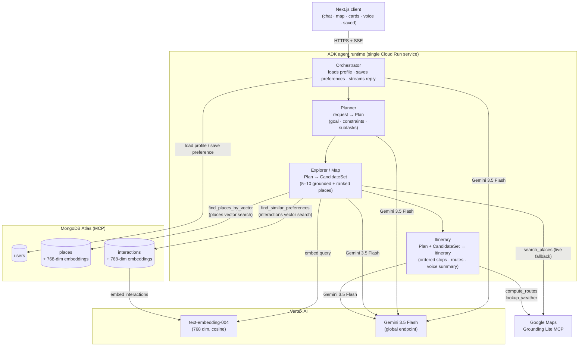

# Hodari

[](https://github.com/ganji759/Map_Me/actions/workflows/ci.yml)
[](./LICENSE)
[](./CONTRIBUTING.md)

**A multi-agent tourist AI assistant for the 2026 FIFA World Cup.** Hodari helps football fans plan grounded, personalized itineraries through a conversational interface backed by real Google Maps data, and renders them on an interactive map with walking/driving routes.

> Hodari (Swahili: *brave / capable*) turns a fan's free time between matches into a concrete plan: where to eat, what to see, and how to get there.

**Live:** https://hodari-frontend-377773225771.us-central1.run.app

---

## Features

- **Conversational planning** — describe time, budget, dietary needs, and location in plain language; Hodari streams back a structured plan.
- **Grounded place search** — places come from Google Maps (Maps Grounding Lite MCP): real names, coordinates, ratings, hours, and photos — no hallucinations.
- **Feasible itineraries** — stops are ordered to minimize travel, with real distances, durations, and polylines drawn on the map.
- **Place photos** — restaurant and venue photos are auto-fetched from the Places API and shown directly on the sidebar cards.
- **Save places** — bookmark any place from the sidebar; saved items persist per user. Access them at `/saved`.
- **Visit planner** — on the Saved page, set a visit date and note for each saved place. A calendar view groups planned visits by month.
- **Personalization** — the Explorer agent calls `find_similar_preferences` (Atlas Vector Search on the `interactions` collection) to score candidates against the user's past liked/visited/disliked places before returning results.
- **Interactive map** — custom pins, route polylines, expandable place cards, full-screen mode, and per-place follow-up chat.
- **Push-to-talk voice** — server-side Gemini STT + TTS via Vertex AI.
- **Chat history with delete** — conversations are saved in the browser; hover any entry in the sidebar to delete it.
- **Email login** — no passwords; enter a name + email to create or resume a fan profile stored in MongoDB.
- **Dark / light themes** and a **PWA** install target.

---

## Architecture

Four agents run **in a single process** (in-process routing, not four services). The Orchestrator owns session state and streams the final answer to the client over SSE.



Inter-agent contracts are Pydantic schemas with one retry on malformed output: `Plan` → `CandidateSet` → `Itinerary`.

**Explorer tool execution (parallel):**
1. `find_similar_preferences` — vector search on `interactions` → past liked/disliked categories as personalization signal
2. `find_places_by_vector` — vector search on seeded `places` → pre-embedded venue candidates
3. `search_places` (Maps MCP) — live Google Maps call for new or niche venues
Results are merged, deduplicated, and re-ranked using `personalization_score` (0.0–1.0).

| Agent | Input | Output | Tools |
|---|---|---|---|
| **Orchestrator** | user message + profile + history | streamed reply | `load_user_profile`, `save_preference` (MongoDB MCP) |
| **Planner** | request + profile | `Plan` | none — pure reasoning |
| **Explorer / Map** | `Plan` | `CandidateSet` | `find_similar_preferences` (interactions vector search), `find_places_by_vector` (places vector search), `search_places` (Maps MCP — live fallback) |
| **Itinerary** | `Plan` + `CandidateSet` | `Itinerary` | `compute_routes`, `lookup_weather` (Maps MCP) |

### Production deployment

Both services run on **Google Cloud Run** with a **MongoDB MCP sidecar** container:

```
hodari-agent (port 8080)        ← Python ADK server
  + mongodb-mcp sidecar (3100)  ← MCP bridge to Atlas

hodari-frontend (port 3000)     ← Next.js standalone
  + mongodb-mcp sidecar (3100)  ← MCP bridge (for login route)
```

Cloud Run service definitions live in `infra/`. Secrets (MongoDB URI, Maps API key) are stored in Google Secret Manager and injected at runtime.

---

## Tech stack

| Layer | Technology |
|---|---|
| Frontend | Next.js 15 (App Router), React 18, Tailwind CSS, PWA |
| Map UI | Google Maps JavaScript API + Places API |
| Agent runtime | Python 3.12, Google Agent Development Kit (ADK) |
| LLM | Gemini 3.5 Flash via Vertex AI (`global` endpoint) |
| Embeddings | Vertex AI `text-embedding-004` (768 dimensions) |
| Database | MongoDB Atlas — `users`, `places`, `interactions` |
| Vector search | Atlas Vector Search (HNSW, cosine) — two indexes: `places_embedding` + `interactions_embedding` |
| DB access | MongoDB MCP Server (sidecar, no direct driver) |
| Maps grounding | Maps Grounding Lite MCP (`https://mapstools.googleapis.com/mcp`) |
| Schemas | Pydantic |
| Secrets | Google Secret Manager |
| Deployment | Google Cloud Run (agent + frontend) |

---

## Repository structure

```
Map_Me/
├── agents/
│   ├── hodari/
│   │   ├── agent.py            # Orchestrator + SequentialAgent pipeline
│   │   ├── sub_agents/         # planner.py · explorer.py · itinerary.py
│   │   ├── tools/              # maps_mcp.py · mongo_tools.py · pipeline_tool.py
│   │   └── schemas/            # contracts.py (Plan, CandidateSet, Itinerary)
│   ├── Dockerfile
│   ├── cloudbuild.yaml         # builds agent image via Cloud Build
│   ├── requirements.txt
│   └── .env.example
├── client/
│   ├── app/
│   │   ├── page.tsx            # landing page
│   │   ├── chat/page.tsx       # main chat + map interface
│   │   ├── login/page.tsx      # email login
│   │   ├── saved/page.tsx      # saved places + visit calendar
│   │   └── api/                # chat · session · feedback · saved · place-photos · directions · voice
│   ├── components/
│   │   ├── ChatPanel.tsx       # chat, history sidebar, voice
│   │   ├── LandingPage.tsx     # root layout + state management
│   │   ├── MapView.tsx         # map with pins and route overlays
│   │   ├── PlaceListPanel.tsx  # sidebar place cards with photos + save button
│   │   ├── PlaceDetailsPanel.tsx
│   │   ├── ModelSwitcher.tsx
│   │   └── landing/            # landing page components
│   ├── lib/                    # types.ts · stream.ts · mapActions.ts · voice.ts
│   ├── Dockerfile
│   └── cloudbuild.yaml         # builds frontend image via Cloud Build
├── infra/
│   ├── cloudrun-agent.example.yaml     # template: agent + MCP sidecar
│   ├── cloudrun-frontend.example.yaml  # template: frontend + MCP sidecar
│   ├── mongodb-mcp/Dockerfile          # pre-installs mongodb-mcp-server
│   └── README.md                       # how to fill in the templates
├── docs/
│   ├── Hodari_System_Architecture.md   # the design reference
│   ├── SECURITY_HARDENING.md           # deployment hardening checklist
│   ├── BILLING.md                      # usage metering and Stripe credit packs
│   ├── PERFORMANCE_OPTIMIZATION_PLAN.md
│   ├── CAPABILITIES_ROADMAP.md
│   ├── FEATURE_EXPANSION_ROADMAP.md
│   └── UI_OVERHAUL_SPRINT.md
├── .github/                    # CI, issue templates, pull request template
├── CONTRIBUTING.md
├── SECURITY.md
├── CODE_OF_CONDUCT.md
├── LICENSE
└── CLAUDE.md
```

---

## Prerequisites

- **Node.js** 18+ and npm
- **Python 3.12** (official CPython — MSYS2/MinGW Python lacks `pydantic-core` wheels)
- **MongoDB Atlas** cluster + connection string
- **Google Cloud project** with these APIs enabled:
  - Vertex AI API
  - Maps Grounding Lite API
  - Maps JavaScript API + Places API
- **gcloud CLI** — `winget install Google.CloudSDK`

---

## Local development

Three processes, each in its own terminal. Start them in order.

```
:3100  MongoDB MCP server  →  :8000  ADK agents  →  :3000  Next.js client
```

**Terminal 1 — MongoDB MCP server:**

```bash
# macOS / Linux
MDB_MCP_CONNECTION_STRING="<Atlas URI>" npx mongodb-mcp-server --transport http --httpPort=3100

# Windows PowerShell
$env:MDB_MCP_CONNECTION_STRING="<Atlas URI>"; npx mongodb-mcp-server --transport http --httpPort=3100
```

**Terminal 2 — ADK agents:**

```bash
cd agents

# First-time: create venv
py -3.12 -m venv .venv

# Activate — Windows PowerShell
.\.venv\Scripts\Activate.ps1
# Activate — macOS / Linux
source .venv/bin/activate

pip install -r requirements.txt
cp .env.example .env    # fill in values

# Start (call the venv's adk directly on Windows to avoid PATH shadowing)
.\.venv\Scripts\adk.exe api_server hodari
# macOS / Linux
adk api_server hodari
```

**Terminal 3 — Next.js client:**

```bash
cd client
npm install
cp .env.local.example .env.local   # fill in values
npm run dev
```

Open **http://localhost:3000**. Verify with `curl http://localhost:8000/list-apps` → `["hodari"]`.

### Environment variables

**`agents/.env`**

| Variable | Value |
|---|---|
| `GOOGLE_GENAI_USE_VERTEXAI` | `TRUE` |
| `GOOGLE_CLOUD_PROJECT` | your GCP project ID |
| `GOOGLE_CLOUD_LOCATION` | `global` (Gemini 3.x is only served from the global Vertex endpoint) |
| `GEMINI_MODEL` | `gemini-3.5-flash` |
| `GOOGLE_MAPS_API_KEY` | backend key — enable Maps Grounding Lite API |
| `MONGODB_URI` | Atlas connection string |
| `MONGODB_DATABASE` | `hodari` |
| `MONGODB_MCP_URL` | `http://localhost:3100/mcp` |

**`client/.env.local`**

| Variable | Value |
|---|---|
| `NEXT_PUBLIC_GOOGLE_MAPS_API_KEY` | frontend key — enable Maps JS API + Places API |
| `GOOGLE_MAPS_SERVER_KEY` | server-side key for the Places photo proxy (can be the same key) |
| `ADK_BASE_URL` | `http://localhost:8000` |
| `ADK_APP_NAME` | `hodari` |
| `MONGODB_MCP_URL` | `http://localhost:3100/mcp` |
| `MONGODB_DATABASE` | `hodari` |

---

## Deployment (Google Cloud Run)

Both images are built via Cloud Build (no local Docker needed).

```bash
# Build frontend
gcloud builds submit --config client/cloudbuild.yaml --project <PROJECT_ID> client/

# Build agent
gcloud builds submit --config agents/cloudbuild.yaml --project <PROJECT_ID> agents/

# First time only: copy the templates and fill in your project id.
#   cp infra/cloudrun-agent.example.yaml    infra/cloudrun-agent.yaml
#   cp infra/cloudrun-frontend.example.yaml infra/cloudrun-frontend.yaml
# Your real copies stay out of git. See infra/README.md.

# After each build, pin the new digest in infra/cloudrun-*.yaml then:
gcloud run services replace infra/cloudrun-frontend.yaml --region us-central1 --project <PROJECT_ID>
gcloud run services replace infra/cloudrun-agent.yaml   --region us-central1 --project <PROJECT_ID>

# Make the frontend public (first deploy only).
# Do NOT make the agent public in production. See docs/SECURITY_HARDENING.md.
gcloud run services add-iam-policy-binding hodari-frontend --member="allUsers" --role="roles/run.invoker" --region us-central1
gcloud run services add-iam-policy-binding hodari-agent   --member="allUsers" --role="roles/run.invoker" --region us-central1
```

**Secrets required in Secret Manager:** `MONGODB_URI`, `GOOGLE_MAPS_API_KEY`, `NEXT_PUBLIC_GOOGLE_MAPS_API_KEY`.

---

## Build phasing

- **MVP (current)** — all four agents (Orchestrator → Planner → Explorer → Itinerary) run in one process with in-process routing. The Explorer runs three tools in parallel: vector search on the seeded `places` collection, vector search on the user's `interactions` history for personalization, and a live `search_places` call via Maps MCP as a fallback. Embeddings are generated on demand via Vertex AI `text-embedding-004`.
- **Phase 2** — per-agent Cloud Run services (independent scaling), expanded `places` seed coverage, `lookup_weather`-driven itinerary adjustments.

See [`Hodari_System_Architecture.md`](./Hodari_System_Architecture.md) for the full spec.

---

## Out of scope (MVP)

Booking/payments, email notifications, calendar sync, OAuth, and multilingual support are intentionally deferred.

---

## Contributing

Contributions are welcome. Read [CONTRIBUTING.md](./CONTRIBUTING.md) for the
setup, the code style, and the pull request process. Everyone who takes part
must follow the [Code of Conduct](./CODE_OF_CONDUCT.md).

Good places to start:

- Issues labelled `good first issue`.
- Documentation fixes. These need no prior issue.
- New Explorer tools. Add a tool to an existing agent. Do not add a fifth agent.

---

## Security

Do not report a security problem in a public issue. Read
[SECURITY.md](./SECURITY.md) for the private reporting process.

If you deploy your own instance, work through
[docs/SECURITY_HARDENING.md](./docs/SECURITY_HARDENING.md) first. Hodari holds
real user data and calls paid APIs.

---

## License

Licensed under the Apache License, Version 2.0. See [LICENSE](./LICENSE) and
[NOTICE](./NOTICE).

Hodari calls Google Maps Platform, Vertex AI, MongoDB Atlas, and Stripe. Each
service has its own terms. This license grants you no right to use them. Bring
your own keys and accept the terms of each provider.

The name "Hodari" and the Hodari logo are not covered by the license. See
Section 6 of the Apache License.
